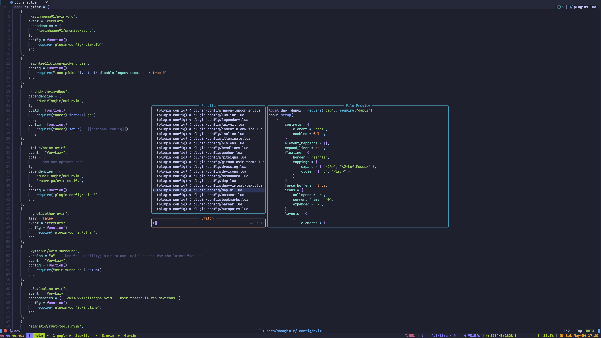
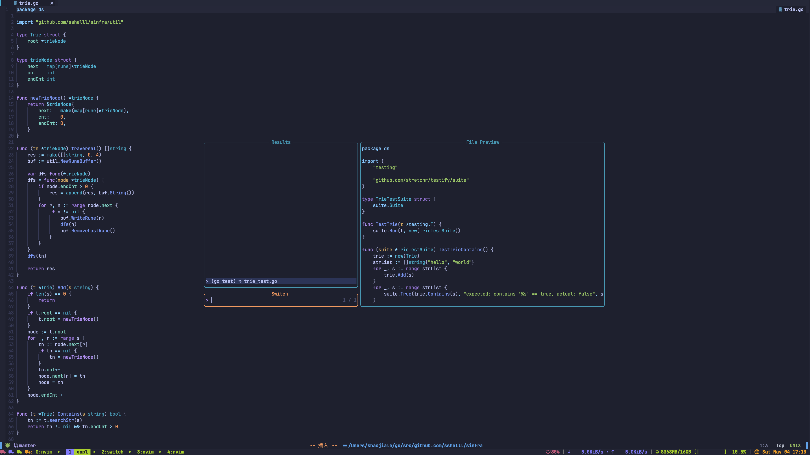

# telescope-switch.nvim
> A [telescope](https://github.com/nvim-telescope/telescope.nvim) extension that helps you to switch between files.


## Demo





## Usage

`:Telescope switch`


## Install

```lua
{
    'sshelll/telescope-switch.nvim',
    dependencies = { 'nvim-telescope/telescope.nvim' },
    lazy = true,
},
```


## Setup

```lua
require('telescope').setup {
    defaults = {
        -- ...
    },
    pickers = {
        -- ...
    },
    -- config telescope-switch here ⬇️
    extensions = {
        switch  = {
            matchers = {
                {
                    name = 'go test',
                    from = '(.*).go$',
                    to = '%1_test.go'
                },
                {
                    name = 'go impl',
                    from = '(.*)_test.go$',
                    to = '%1.go'
                },
                {
                    name = "plugin config",
                    from = "/lua/plugins.lua$",
                    to = "/lua/plugin-config/*.lua", -- this is overriden by 'search'
                    search = "/lua/plugin-config"    -- this works
                },
                {
                    name = "plugin list",
                    from = "/lua/plugin%-config/.*.lua$",
                    to = "/lua/plugins.lua",
                },
                {
                    name = "rust test",
                    from = "/src/(.*).rs$",
                    to = "/tests/*.rs",
                },
            },
           picker = {
                seperator = "⇒",
                layout_strategy = 'horizontal', -- telescope layout_strategy
                layout_config = {               -- telescope layout_config
                    width = 0.5,
                    height = 0.4,
                    preview_width = 0.6,
                },
                preview = true,                 -- set to false to disable telescope preview
            }
        }
    }
}

require('telescope').load_extension('switch')
```


## Configuration QA

### A. Matcher

**1. From && To**

Basically I use `${current_file_path}:gsub(from, to)` in lua to get the target files, so if you have any doubts about it, you can try to run this line of code in your lua REPL to test.

Here is one simple tip:

if you have `( ) . % + - * ? [ ^ $` in `from` field, please add `%` to escape them.

**2. Search**

<u>If `search` was set, then `to` will be ignored.</u>

`search` is used to find all files with the given path, and this path <u>should start with the 2nd level of</u> `vim.fn.getcwd()`.

For example:

```sh
.
├── go.mod
├── go.sum
├── .gitignore
├── ast
│   ├── parse.go
│   └── parse_test.go
└── util
    ├── math.go
    └── math_test.go

```

If you want to jump from `./ast/xx.go` to `./util/xx.go`, then config like this:

```lua
{
    name = "ast to util",
    from = "/ast/(.*).go$",
    search = "/util"
}
```

Why search? Because sometimes we don't have a common rule to jump!

**3. Builtin Matchers**

See `/lua/telescope/_extensions/switch/matcher.lua` for more detail. Currently there's only a golang matcher.

Different matchers should have different `from + to + search`, otherwise it'll be filtered.


### B. Picker

See [telescope.nvim](https://github.com/nvim-telescope/telescope.nvim) for more detail.

## Alternatives
Inspired by [other.nvim](https://github.com/rgroli/other.nvim)
